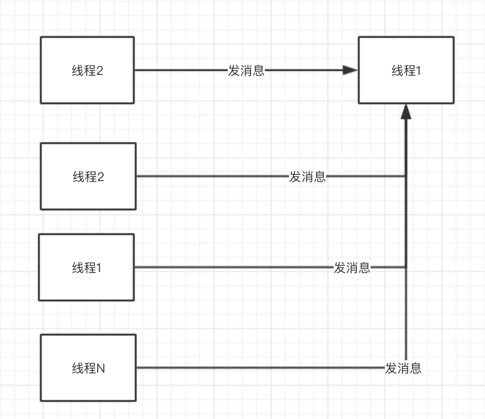
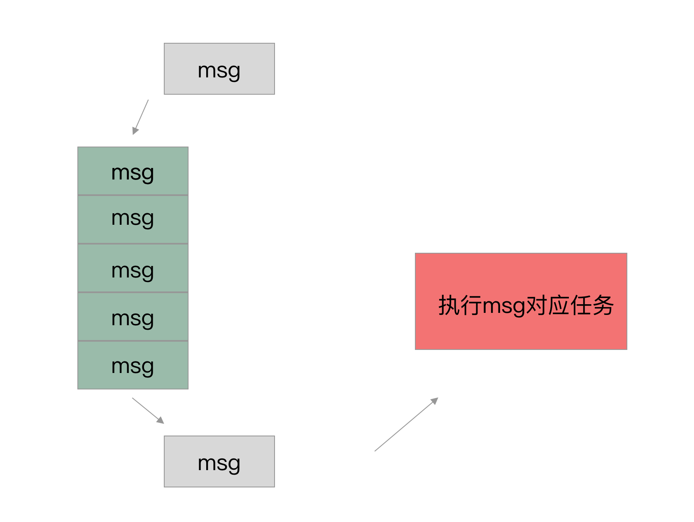

<font size=4 color=#D2691E> 手写简易handler 2019年05月02日 </font>

### 0.谈谈我对Handler的理解
Handler是为了解决线程间通讯。一个线程2发送消息给另外一个线程1，线程1拿到消息后，执行对应的操作。<br>
<br>
就会有一个问题，线程2发给线程1消息的时候，线程1正在执行任务，不能立刻执行线程2新发来的消息对应的任务，怎么办呢？就需要将消息存起来。<br>
<br>
对应的实现就是，有一个容器去盛放这些消息，可以往这个容器中添加消息，有个循环不断的从容器中取消息，执行消息对应的任务。

### 1.第一步，要写一个消息处理模型（模拟添加消息，读取消息，处理消息的过程）
```java
1.有个容器盛放消息，有消息时，循环读消息执行任务，没消息时循环停止。
```
### Moudle - myhandler1 的实现为：
* 1.点击"添加消息"主线程往消息队列添加10条消息。
* 2.线程1读消息，交给handler处理。
* 3.handler处理完消息以后，线程1挂起，主线程添加消息后，唤醒起的线程1。<br>
### myhanlder1 主要就是为了模拟添加消息，读取消息，处理消息的过程。
代码见 Moudle - myhandler1


MyMessage
```java
/**
 * 消息
 *
 * @author chengxiaobo
 * @time 2019/5/2 08:30
 */
class MyMessage(val WHAT: Int)
```
MyMessageQueue

```java
/**
 * 消息队列
 *
 * @author chengxiaobo
 * @time 2019/5/2 08:31
 */
class MyMessageQueue {

    private val messageList = LinkedList<MyMessage>()
    private val condition = Object()

    /**
     * 主线程添加消息，如果添加消息之前是空队列，通知挂起的线程
     */
    fun addMessage(message: MyMessage) {
        synchronized(condition) {
            messageList.add(message)
            if (messageList.size == 1) {
                condition.notify()
            }
        }
    }

    /**
     * 线程1 读取消息，如果消息队列没有消息，则线程挂起
     */
    fun getMessage(): MyMessage {
        synchronized(condition) {
            if (messageList.size == 0) {
                loge("线程挂起")
                condition.wait()
            }
            return messageList.removeAt(0)
        }
    }
}
```
MyHandler

```java
/**
 * 处理消息
 *
 * @author chengxiaobo
 * @time 2019/5/2 08:32
 */
abstract class MyHandler {
    abstract fun handleMessage(message: MyMessage)
}
```
MyHandler1Activity  

```java
/**
 * MyHandler1Activity
 *
 * @author chengxiaobo
 * @time 2019/5/2 09:30
 */
class MyHandler1Activity : AppCompatActivity() {

    override fun onCreate(savedInstanceState: Bundle?) {
        super.onCreate(savedInstanceState)
        setContentView(R.layout.activity_my_handler1)

        //1.创建消息队列
        val myMessageQueue = MyMessageQueue()
        //2.创建MyHandler，处理消息
        val myHandler = object : MyHandler() {
            override fun handleMessage(message: MyMessage) {
                loge("deal message ${message.WHAT}")
                Thread.sleep(1000)
            }
        }
        //3.线程1，读取消息队列的消息，交给handler处理。
        val myThread1 = Thread(Runnable {
            while (true) {
                myHandler.handleMessage(myMessageQueue.getMessage())
            }
        })
        myThread1.start()

        //4.点击一次，主线程添加10条消息到消息队列
        var i = 0
        btnAddMessage.setOnClickListener {
            for (j in 1..10) {
                loge("add message ${(i * 10) + j}")
                myMessageQueue.addMessage(MyMessage((i * 10) + j))
            }
            i++
        }
    }
}
```
运行结果

```java
2019-02-14 16:31:41.065 30033-30727/com.example.myhandler1 E/myHandler1: 线程挂起
2019-02-14 16:31:42.274 30033-30033/com.example.myhandler1 E/myHandler1: add message 1
2019-02-14 16:31:42.274 30033-30033/com.example.myhandler1 E/myHandler1: add message 2
2019-02-14 16:31:42.275 30033-30033/com.example.myhandler1 E/myHandler1: add message 3
2019-02-14 16:31:42.275 30033-30727/com.example.myhandler1 E/myHandler1: deal message 1
2019-02-14 16:31:42.275 30033-30033/com.example.myhandler1 E/myHandler1: add message 4
2019-02-14 16:31:42.275 30033-30033/com.example.myhandler1 E/myHandler1: add message 5
2019-02-14 16:31:42.275 30033-30033/com.example.myhandler1 E/myHandler1: add message 6
2019-02-14 16:31:42.275 30033-30033/com.example.myhandler1 E/myHandler1: add message 7
2019-02-14 16:31:42.275 30033-30033/com.example.myhandler1 E/myHandler1: add message 8
2019-02-14 16:31:42.275 30033-30033/com.example.myhandler1 E/myHandler1: add message 9
2019-02-14 16:31:42.275 30033-30033/com.example.myhandler1 E/myHandler1: add message 10
2019-02-14 16:31:43.276 30033-30727/com.example.myhandler1 E/myHandler1: deal message 2
2019-02-14 16:31:44.278 30033-30727/com.example.myhandler1 E/myHandler1: deal message 3
2019-02-14 16:31:45.279 30033-30727/com.example.myhandler1 E/myHandler1: deal message 4
2019-02-14 16:31:46.281 30033-30727/com.example.myhandler1 E/myHandler1: deal message 5
2019-02-14 16:31:47.284 30033-30727/com.example.myhandler1 E/myHandler1: deal message 6
2019-02-14 16:31:48.285 30033-30727/com.example.myhandler1 E/myHandler1: deal message 7
2019-02-14 16:31:49.287 30033-30727/com.example.myhandler1 E/myHandler1: deal message 8
2019-02-14 16:31:50.289 30033-30727/com.example.myhandler1 E/myHandler1: deal message 9
2019-02-14 16:31:51.291 30033-30727/com.example.myhandler1 E/myHandler1: deal message 10
2019-02-14 16:31:52.293 30033-30727/com.example.myhandler1 E/myHandler1: 线程挂起
```

### 2.第二步，第一步的myhandler1有如下问题。
* 1.第一步的MyHandler1Activity的内容有点多，耦合性比较强，可以抽象出来一个Looper对象。
* 2.第一步主要是为了模拟消息模型，写的比较死，主线程往消息队列添加消息，另外一个线程去读消息，交个handler处理。现实中，可能存在好多个线程，以及好多个handler。所以需要理清楚其中的关系。
    * 1.一个线程对应一个消息队列。<br>
    * 2.一个线程对应着多个handler。<br>
    * 3.一个线程向另一个线程发送消息，并不是直接往消息队列里面添加消息，是通过handler添加的，并制定该handler处理。<br>

### Moudle - myhandler2 的实现为：
* 1.点击"添加消息"主线程发送10条消息给handler。
* 2.handler往Looper对应的消息队列里面添加消息。
* 3.在子线程创建Looper对象，looper循环读取消息队列的消息，交给对应的handler处理。
* 4.handler处理完消息以后，线程挂起，当handler再添加消息，则线程唤醒接着处理消息。
<br>
代码见 Moudle - myhandler2

MyMessage 

```java
/**
 * 消息
 *
 * @author chengxiaobo
 * @time 2019/5/2 08:30
 */
class MyMessage(val WHAT: Int)

```
MyHandlerMessage
```java
/**
 *
 * @author chengxiaobo
 * @time 2019/5/6 13:34
 */
class MyHandlerMessage (val myMessage: MyMessage,val myHandler: MyHandler)
```

MyMessageQueue
```java
/**
 * 消息队列
 *
 * @author chengxiaobo
 * @time 2019/5/6 12:31
 */
class MyMessageQueue {

    private val messageList = LinkedList<MyHandlerMessage>()
    private val condition = Object()

    /**
     * 主线程添加消息，如果添加消息之前是空队列，通知挂起的线程
     */
    fun addMessage(message: MyHandlerMessage) {
        synchronized(condition) {
            messageList.add(message)
            if (messageList.size == 1) {
                condition.notify()
            }
        }
    }

    /**
     * 线程1 读取消息，如果消息队列没有消息，则线程挂起
     */
    fun getMessage(): MyHandlerMessage {
        synchronized(condition) {
            if (messageList.size == 0) {
                loge("线程挂起")
                condition.wait()
            }
            return messageList.removeAt(0)
        }
    }
}
```

MyHandler
```java 
/**
 * 处理消息
 *
 * @author chengxiaobo
 * @time 2019/5/6 13:32
 */
abstract class MyHandler(private val myLooper: MyLooper?) {
    abstract fun handleMessage(message: MyMessage)

    //往消息队列里面添加消息
    fun sendMessage(message: MyMessage) {
        myLooper?.queue?.addMessage(MyHandlerMessage(message, this))
    }
}
```

MyLooper
```java
/**
 * looper
 *
 * @author chengxiaobo
 * @time 2019/5/6 13:35
 */
class MyLooper {

    var queue = MyMessageQueue()

    fun loop() {
        while (true) {
            val myHandlerMessage = queue.getMessage()
            myHandlerMessage.myHandler.handleMessage(myHandlerMessage.myMessage)
        }
    }
}

```

MyHandler2Activity
```java
/**
 * @author chengxiaobo
 * @time 2019/5/5 16:00
 */
class MyHandler2Activity : AppCompatActivity() {

    override fun onCreate(savedInstanceState: Bundle?) {
        super.onCreate(savedInstanceState)
        setContentView(R.layout.activity_my_handler2)

        //1.创建looper
        var myLooper: MyLooper? = null
        val myThread1 = Thread(Runnable {
            myLooper = MyLooper()
            myLooper?.loop()
        })
        myThread1.start()

        //主线程睡眠1s钟，保证子线程的myLooper创建成功
        //myLooper在子线程创建，handler在主线程创建，handler创建需要looper，handler创建的时候，需要保证looper已经创建完
        //这里不去写了，会分析一下 HandlerThread这块是怎么处理的。
        Thread.sleep(1000)

        //2.创建MyHandler，处理消息
        val myHandler = object : MyHandler(myLooper) {
            override fun handleMessage(message: MyMessage) {
                loge("deal message ${message.WHAT}")
                Thread.sleep(1000)
            }
        }
        //3.点击一次，主线程添加10条消息到消息队列
        var i = 0
        btnAddMessage.setOnClickListener {
            for (j in 1..10) {
                loge("add message ${(i * 10) + j}")
                myHandler.sendMessage(MyMessage((i * 10) + j))
            }
            i++
        }
    }
}
```
运行结果(模拟器的时间是坏掉的，哈哈)
```java
 2019-02-14 22:14:33.679 1629-2787/com.example.myhandler2 E/myHandler2: 线程挂起
2019-02-14 22:14:37.435 1629-1629/com.example.myhandler2 E/myHandler2: add message 1
2019-02-14 22:14:37.435 1629-1629/com.example.myhandler2 E/myHandler2: add message 2
2019-02-14 22:14:37.435 1629-1629/com.example.myhandler2 E/myHandler2: add message 3
2019-02-14 22:14:37.435 1629-2787/com.example.myhandler2 E/myHandler2: deal message 1
2019-02-14 22:14:37.435 1629-1629/com.example.myhandler2 E/myHandler2: add message 4
2019-02-14 22:14:37.435 1629-1629/com.example.myhandler2 E/myHandler2: add message 5
2019-02-14 22:14:37.435 1629-1629/com.example.myhandler2 E/myHandler2: add message 6
2019-02-14 22:14:37.435 1629-1629/com.example.myhandler2 E/myHandler2: add message 7
2019-02-14 22:14:37.435 1629-1629/com.example.myhandler2 E/myHandler2: add message 8
2019-02-14 22:14:37.435 1629-1629/com.example.myhandler2 E/myHandler2: add message 9
2019-02-14 22:14:37.436 1629-1629/com.example.myhandler2 E/myHandler2: add message 10
2019-02-14 22:14:38.437 1629-2787/com.example.myhandler2 E/myHandler2: deal message 2
2019-02-14 22:14:39.439 1629-2787/com.example.myhandler2 E/myHandler2: deal message 3
2019-02-14 22:14:40.441 1629-2787/com.example.myhandler2 E/myHandler2: deal message 4
2019-02-14 22:14:41.444 1629-2787/com.example.myhandler2 E/myHandler2: deal message 5
2019-02-14 22:14:42.447 1629-2787/com.example.myhandler2 E/myHandler2: deal message 6
2019-02-14 22:14:43.449 1629-2787/com.example.myhandler2 E/myHandler2: deal message 7
2019-02-14 22:14:44.453 1629-2787/com.example.myhandler2 E/myHandler2: deal message 8
2019-02-14 22:14:45.455 1629-2787/com.example.myhandler2 E/myHandler2: deal message 9
2019-02-14 22:14:46.458 1629-2787/com.example.myhandler2 E/myHandler2: deal message 10
2019-02-14 22:14:47.460 1629-2787/com.example.myhandler2 E/myHandler2: 线程挂起
```

### 3.第三步，我实现的MyLooper和Android源码实现不一致，可以修改一下。
平时我们用Looper的时候，是下面这样用的，发现Looper是提供了一些静态的方法。为了保证每个线程一个Looper对象，使用了 ThreadLocal实现。接下来，我们的looper也要按照Android的源码去实现。
```java
Looper.prepare();
Looper.myLooper();
Looper.loop();
```

### Moudle - myhandler3 和 myhandler2的实现一样，只不过对MyLooper进行了修改。
代码见 Moudle - myhandler3

MyLooper
```java
/**
 * looper
 *
 * @author chengxiaobo
 * @time 2019/5/6 23:35
 */
class MyLooper {

    private constructor()

    var queue: MyMessageQueue? = null

    companion object {

        private val threadlocal = ThreadLocal<MyLooper>()

        fun prepare() {
            val myLooper = MyLooper()
            threadlocal.set(myLooper)
            myLooper.queue = MyMessageQueue()

        }

        fun loop() {
            val queue = myLooper()?.queue
            while (true) {
                val myHandlerMessage = queue?.getMessage()
                myHandlerMessage?.myHandler?.handleMessage(myHandlerMessage.myMessage)
            }
        }

        fun myLooper(): MyLooper? {
            return threadlocal.get()
        }
    }
}
```
MyHandler3Activity
```java
class MyHandler3Activity : AppCompatActivity() {

    override fun onCreate(savedInstanceState: Bundle?) {
        super.onCreate(savedInstanceState)
        setContentView(R.layout.activity_my_handler3)

        //1.创建looper
        var myLooper: MyLooper? = null
        val myThread1 = Thread(Runnable {
            MyLooper.prepare()
            myLooper = MyLooper.myLooper()
            MyLooper.loop()
        })
        myThread1.start()

        //主线程睡眠1s钟，保证子线程的myLooper创建成功
        //myLooper在子线程创建，handler在主线程创建，handler创建需要looper，handler创建的时候，需要保证looper已经创建完
        //这里不去写了，会分析一下 HandlerThread这块是怎么处理的。
        Thread.sleep(1000)

        //2.创建MyHandler，处理消息
        val myHandler = object : MyHandler(myLooper) {
            override fun handleMessage(message: MyMessage) {
                loge("deal message ${message.WHAT}")
                Thread.sleep(1000)
            }
        }
        //3.点击一次，主线程添加10条消息到消息队列
        var i = 0
        btnAddMessage.setOnClickListener {
            for (j in 1..10) {
                loge("add message ${(i * 10) + j}")
                myHandler.sendMessage(MyMessage((i * 10) + j))
            }
            i++
        }
    }
}
```
运行结果
```java
2019-02-15 00:31:33.945 3899-3930/com.example.myhandler3 E/myHandler3: 线程挂起
2019-02-15 00:31:37.299 3899-3899/com.example.myhandler3 E/myHandler3: add message 1
2019-02-15 00:31:37.300 3899-3899/com.example.myhandler3 E/myHandler3: add message 2
2019-02-15 00:31:37.300 3899-3930/com.example.myhandler3 E/myHandler3: deal message 1
2019-02-15 00:31:37.300 3899-3899/com.example.myhandler3 E/myHandler3: add message 3
2019-02-15 00:31:37.300 3899-3899/com.example.myhandler3 E/myHandler3: add message 4
2019-02-15 00:31:37.300 3899-3899/com.example.myhandler3 E/myHandler3: add message 5
2019-02-15 00:31:37.300 3899-3899/com.example.myhandler3 E/myHandler3: add message 6
2019-02-15 00:31:37.301 3899-3899/com.example.myhandler3 E/myHandler3: add message 7
2019-02-15 00:31:37.301 3899-3899/com.example.myhandler3 E/myHandler3: add message 8
2019-02-15 00:31:37.301 3899-3899/com.example.myhandler3 E/myHandler3: add message 9
2019-02-15 00:31:37.301 3899-3899/com.example.myhandler3 E/myHandler3: add message 10
2019-02-15 00:31:38.302 3899-3930/com.example.myhandler3 E/myHandler3: deal message 2
2019-02-15 00:31:39.304 3899-3930/com.example.myhandler3 E/myHandler3: deal message 3
2019-02-15 00:31:40.307 3899-3930/com.example.myhandler3 E/myHandler3: deal message 4
2019-02-15 00:31:41.310 3899-3930/com.example.myhandler3 E/myHandler3: deal message 5
2019-02-15 00:31:42.311 3899-3930/com.example.myhandler3 E/myHandler3: deal message 6
2019-02-15 00:31:43.314 3899-3930/com.example.myhandler3 E/myHandler3: deal message 7
2019-02-15 00:31:44.316 3899-3930/com.example.myhandler3 E/myHandler3: deal message 8
2019-02-15 00:31:45.319 3899-3930/com.example.myhandler3 E/myHandler3: deal message 9
2019-02-15 00:31:46.324 3899-3930/com.example.myhandler3 E/myHandler3: deal message 10
2019-02-15 00:31:47.325 3899-3930/com.example.myhandler3 E/myHandler3: 线程挂起
```

### 4.第二步和第三步有个问题需要解决，见下面代码。（myLooper在子线程创建，handler在主线程创建，handler创建需要looper，handler创建的时候需要保证looper已经创建完） 见后面对HandlerThread的源码分析。
MyHandler3Activity
```java
class MyHandler3Activity : AppCompatActivity() {

    override fun onCreate(savedInstanceState: Bundle?) {
        super.onCreate(savedInstanceState)
        setContentView(R.layout.activity_my_handler3)

        //1.创建looper
        var myLooper: MyLooper? = null
        val myThread1 = Thread(Runnable {
            MyLooper.prepare()
            myLooper = MyLooper.myLooper()
            MyLooper.loop()
        })
        myThread1.start()

        //主线程睡眠1s钟，保证子线程的myLooper创建成功
        //myLooper在子线程创建，handler在主线程创建，handler创建需要looper，handler创建的时候，需要保证looper已经创建完
        //这里不去写了，会分析一下 HandlerThread这块是怎么处理的。
        Thread.sleep(1000)

        //2.创建MyHandler，处理消息
        val myHandler = object : MyHandler(myLooper) {
            override fun handleMessage(message: MyMessage) {
                loge("deal message ${message.WHAT}")
                Thread.sleep(1000)
            }
        }
        //3.点击一次，主线程添加10条消息到消息队列
        var i = 0
        btnAddMessage.setOnClickListener {
            for (j in 1..10) {
                loge("add message ${(i * 10) + j}")
                myHandler.sendMessage(MyMessage((i * 10) + j))
            }
            i++
        }
    }
}                               
```
以下内容为HandlerThread的源码分析

* 1. run 方法，创建完Looper以后，会notifyAll()
* 2. getLooper方法， 如果别的线程getLooper为空，线程会挂起，等到looper创建以后，该线程会唤醒。
* 3. 那么什么时候会调用 getLooper方法呢？getThreadHandler()里面就有调用getLooper方法。
* 总结一下，HandlerThread执行run方法，去创建Looper,主线程这时候去获取Handler，这时候线程就会挂起，当子线程创建完Looper以后，会唤醒正在等待的主线程去创建和获取Handler。
``` java
public class HandlerThread extends Thread {
      @Override
    public void run() {
        mTid = Process.myTid();
        Looper.prepare();
        synchronized (this) {
            mLooper = Looper.myLooper();
            notifyAll();
        }
        Process.setThreadPriority(mPriority);
        onLooperPrepared();
        Looper.loop();
        mTid = -1;
    }

      public Looper getLooper() {
        if (!isAlive()) {
            return null;
        }
        
        // If the thread has been started, wait until the looper has been created.
        synchronized (this) {
            while (isAlive() && mLooper == null) {
                try {
                    wait();
                } catch (InterruptedException e) {
                }
            }
        }
        return mLooper;
    }
     public Handler getThreadHandler() {
        if (mHandler == null) {
            mHandler = new Handler(getLooper());
        }
        return mHandler;
    }

}
```

### 5.其他疑问：当主线程没有消息的时候，线程挂起，这时候，用户触摸屏幕，是不是就没有反应了，因为主线程挂起了。
答：用户触摸屏幕，不是主线程的事件，而是系统的事件，系统会往主线程的消息队列里面添加一条消息。